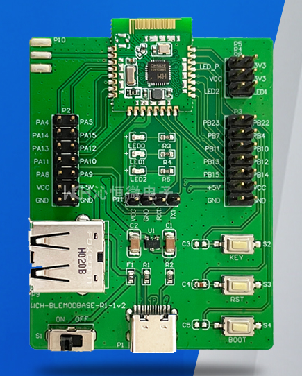
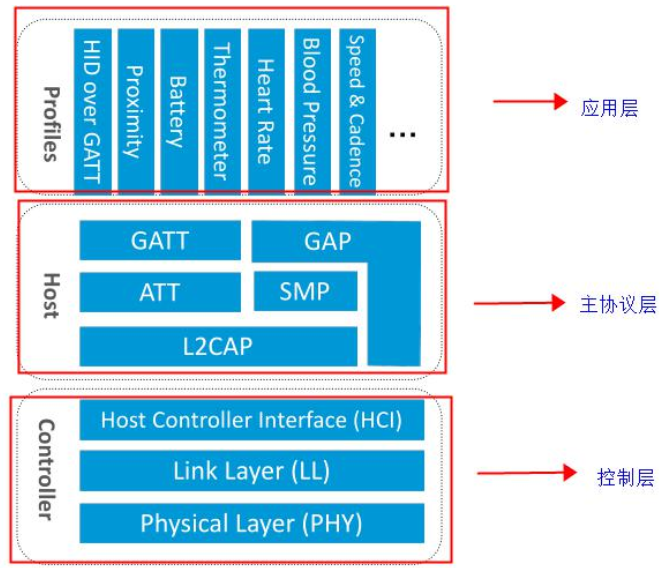
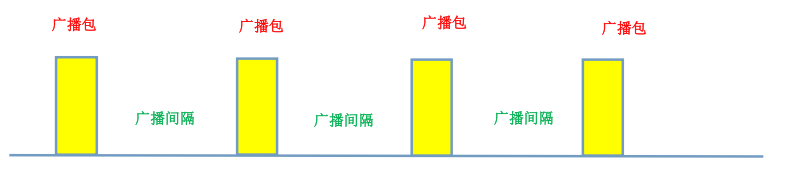
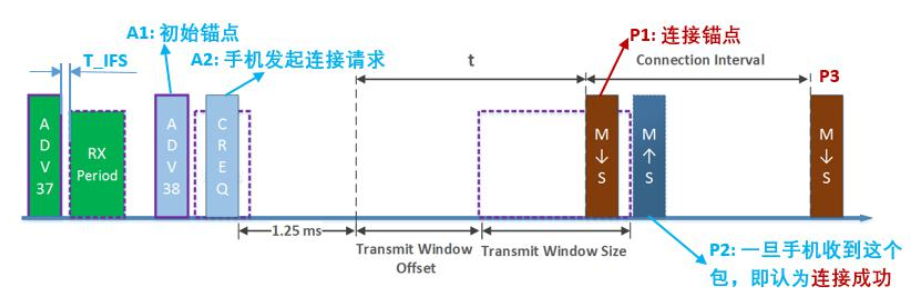
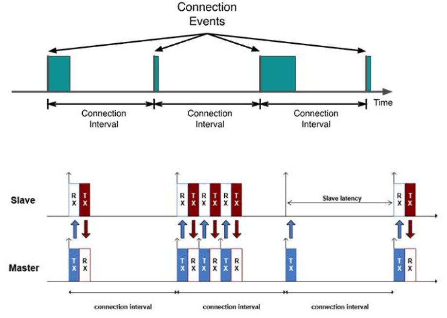
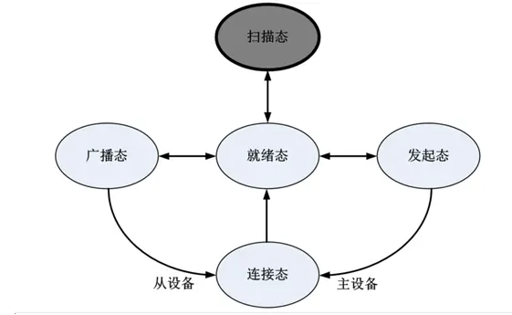

# 资料
# Bluetooth Core Spec
https://www.bluetooth.com/specifications/specs/core-specification-5-3/

# 平台
WCH CH582M, WCH-BLEMODBASE-R1-1v2

# 测试软件/工具

nRF Connect
WireShark
蓝牙抓包器

# 基础认识

## 蓝牙协议栈

蓝牙协议栈的架构↑

**PHY:**  PHY(物理)层用来指定BLE所用的无线频段，调制解调方式等等。PHY层决定整个BLE芯片的功耗，灵敏度以及Selectivity等射频指标。
**LL:** LL(链路)层是整个BLE协议栈的核心，也是BLE协议栈的难点和重点。Nordic的BLE协议栈能够同时支持20个link , 就是LL层的功劳。LL层需要做的事情非常多，比如具体选择哪个射频通道进行通信，怎么识别控制数据包，具体在哪个时间点将数据包发送出去，怎么保证数据的完整性，ACK如何接收，如何进行重传，以及如何对链路进行管理和控制等等。LL层只负责把数据发出去或者收回来，对数据进行怎样的解析则交给上面的GAP或者ATT。
**HCI:** 主机控制器接口，HCI是可选的，HCI主要用于两颗芯片实现BLE协议栈的场合，用来规范两者之间的通信协议和通信命令等等。
**GAP:**  GAP层是对LL层的Payload(有效数据包)如何进行解析的两种方式中的一种，而且是最简单的一种。GAP简单地对LL Payload进行一些规范和定义，因此GAP层实现的功能非常有限。GAP主要用于 广播，扫描和发起连接等。
**L2CAP:** L2CAP对LL进行了一次简单封装，LL只关心传输数据本身，L2CAP就要区分是加密通道还是普通通道，同时还要对连接进行间隔管理。
**SMP:** SMP用来管理BLE连接的加密和安全的，如何保证连接的安全性，同时不影响用户体验，这些都是SMP需要考虑的工作。
**ATT:** 简单来说， ATT层用来定于用户命令及命令操作的数据，比如读取某个数据或者写某个数据，BLE协议栈中，开发者接触最多的就是ATT。BLE引入了attribute的概念，用来描述一条一条的数据，Attribute除了定义数据，同时定义该数据可以使用的ATT命令。
**GATT:** GATT 用来规范Attribute中的数据内容，并运用Group的概念对attribute进行分类管理。没有GATT，BLE协议栈也能跑，但是互联互通就会出现问题，也正是因为有了GATT和各种各样的GATT Profile, BLE摆脱了Zigbee等无线协议的兼容性困境。
	GATT定义了一些应用标准，只要BLE设备都遵循这些标准，就可以实现互联互通，而不是每个厂家根据自己的需求自己定义标准。

## 蓝牙通信过程
为了维持一个BLE通信的连接，蓝牙引入了 **角色(Role)** 这个概念。一个BLE设备，只能是 **集中器(Central)** 或者 **外围设备(Periphral)** 这两种角色中的任意一个。
Central 总是连接的发起者，而 Periphral 总是被连接者，整个访问与连接的过程都是在 GAP 这一层实现的。

### Periphral 广播
Periphral 想要被 Central 连接， 首先要能被 Central 发现。 Periphral 通过定时广播自身的信息，从而可以被 Central 发现。

每一个广播事件包含三个广播包，分别在37/38/39三个广播信道同时广播相同的信息。

### Central 扫描
Periphral 设备不断地发送广播信号，Central 设备也需要开启扫描窗口才能收到 Periphral 发送地广播包，只有 Central 的扫描窗口和 Periphral 的广播发送窗口匹配上时，两个设备才能匹配成功，因此，两个设备匹配成功是一个概率事件。

### 建立连接

如图所示，手机(Central)在收到 A1 广播包后，会以此为初始点，经过 T_IFS 后给 Advertiser 发送一个 Connection Request(A2),  Advertiser 根据 Connection Request 中的命令信息做好接收准备。Connection Request 其实是在告诉 Advertiser 手机将会在 Transmit Window 期间发送第一个同步包(P1)给到 Advertiser，请 Advertiser 在 Transmit Window 期间将射频接收窗口打开。Advertiser 在收到 P1 之后， 在 T_IFS 之后给手机回复 P2 。一旦手机收到 P2 ，即可认为连接成功，后续将会以 Connection Interval 为周期，周期性地给 Periphral(连接成功后就不会再发送广播包了, Advertiser 转变为Periphral(从机) ) 发送 Packet 。

### 数据收发
在完成建立连接之后，在每一个 Connection interval 开始的时候，Master 和 Slave 都必须交互一次，即 M -> S, 然后 S -> M， 这个过程称为 Connection event。 蓝牙芯片只需要在 Connection event 期间把把射频模块打开，因此蓝牙芯片的平均功耗就可以做到很低。
在 Master 和 Slave 之间没有数据需要交互的时候，他们两个之间发送的都是空包。
在一个 Connect event 期间，Master 和 Slave 之间可以发送多个数据包，提高吞吐率。

主从数据发送的数据包 TX 和 RX 表示方向性的数据通道，也就是蓝牙的空中属性，空中操作事件都是采用蓝牙操作句柄来进行的，因为每个句柄能够唯一表示各个属性，空中特性的的性质包括以下几种
Master RX, Slave TX
- 通知：从机端上传数据给主机，不需要主机回复响应
- 指示：从机端上传数据给主机，需要主机回复一个确认
Master TX, Slave RX
- 写
- 无需响应的写
- 读

## 蓝牙状态机制
蓝牙的链路层(Link Layer) 共有5种状态， 分别是 **就绪态， 广播态，扫描态，  连接态， 发起连接态**， 各个状态之间的转换路径如下图。

以手机连接某个蓝牙模块为例，手机作为主机设备，蓝牙模块作为从机设备。上电之后二者都将处于就绪态，蓝牙模块设置广播数据并开始广播后将转换到广播态；手机扫描附近范围内的蓝牙设备时，手机将处于扫描态，手机尝试连接某个设备时，手机的蓝牙处于发起连接态，连接成功后，二者将都处于链接态。

断开连接之后，二者将都再回到就绪态！ 
