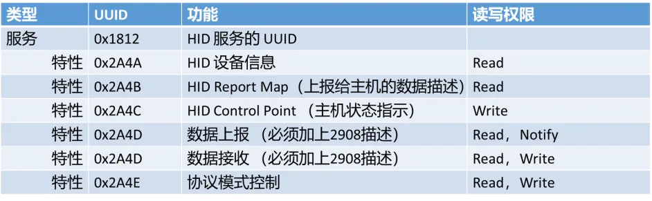

# 基础知识
**参考连接 ：** https://www.bilibili.com/read/cv15067064?spm_id_from=333.999.0.0

HID（Human Interface Device）人体学接口设备，是生活中常见的输入设备，比如键盘鼠标游戏手柄等等。早期的 HID 是设备大部分都是通过 USB 接口来实现，蓝牙技术出现后，通过蓝牙作为传输层，实现了无线 HID 设备。通过低功耗蓝牙实现的 HID 功能一般简称为 HOGP(HID over Gatt Profile)。 

## 蓝牙 HID 设备的实现

任何低功耗蓝牙模块都可以通过软件开发实现HID功能，一个蓝牙模块要实现HID的功能，一般需满足如下两个条件：

### 在广播数据中广播HID的UUID，设备外观，设备名称等信息。 

蓝牙HID广播数据 

HID服务的UUID是0x1812，键盘的外观是0x03C1，鼠标的外观是0x03C2，游戏手柄的外观是0x03C3。
**我要实现的是复合类型的 HID 设备，设备外观将会使用 0x03C0 。**

### 在GATT中实现HID要求的服务和特性


**0x1812**是HID Service的UUID，必须要使用该UUID实现服务。

**0x2A4A**是HID Information 的特性UUID，主要功能是展示HID的信息，其值为4个字节，前两个字节是**HID版本**，一般填入0x01，0x01，表示版本号为1.1。第三个字节是Country Code，一般填入0x00。第四个字节是HID Flags，一般填入0x02，表示Normally Connectable。

**0x2A4B**是Report Map的特性UUID，主要功能是描述HID设备与HID主机数据交互的方式，即二者之间所发送的数据每一位的含义。

**0x2A4C**是Control Point的特性UUID，该特性一定要可Write ，HID主机通过该特性告知HID设备主机的状态，比如电脑休眠后会告知蓝牙键盘也进入低功耗模式。

**0x2A4D**是HID设备与HID主机之间交互数据(Report)的特性UUID。对于键盘设备，当某个按键按下时，HID设备发送数据到HID主机；当开关CapsLock，NumsLook和ScrollLook功能时，HID主机将相关指示灯的状态发送给HID键盘。所以键盘设备需要两个UUID为0x2A4D的特性，一个用于发送数据，另一个用于接收数据(使用UUID为0x2908的描述来区分)。而对于鼠标，游戏手柄这种只发送数据给电脑的设备，只需要定义一个0x2A4D的特性用来发送数据就可以了(当然定义两个也不会出错)。

**0x2A4E**是协议模式的特性UUID，对于键盘和鼠标这两种设备，可能也会在电脑BIOS阶段使用，此阶段的计算机没有进入系统，难以支持复杂的设备。所以键盘鼠标就有两种模式，分别是Report模式和Boot模式，系统启动前使用的是Boot模式，HID设备与HID主机之间使用固定的数据格式进行交互。系统启动完成后，HID主机会通过该特性发数据给HID设备，通知HID设备切换成Report模式，在Report模式下，数据格式由 Report Map 决定。

该特性的数据值为0x00表示Boot模式，0x01表示Report模式。

在Boot模式下，Keyboard Input 的特性UUID是0x2A22，Output 的特性UUID是0x2A32；Mous Input 的特性UUID是0x2A33。


# 广播数据实现
基于 Periphral 工程进行修改实现。

修改 设备的 `advertData[]` 和 `scanRspData[]`

```
static uint8_t advertData[] = {
    /* 设备标识，有限发现模式，不支持经典蓝牙 */
    0x02, // length of this data
    GAP_ADTYPE_FLAGS,
    GAP_ADTYPE_FLAGS_LIMITED | GAP_ADTYPE_FLAGS_BREDR_NOT_SUPPORTED,

    /* 部分服务的UUID */
    0x05,                  // length of this data
    GAP_ADTYPE_16BIT_MORE, // some of the UUID's, but not all
    LO_UINT16(HID_SERV_UUID),
    HI_UINT16(HID_SERV_UUID),
    LO_UINT16(BATT_SERV_UUID),
    HI_UINT16(BATT_SERV_UUID),

    /* Device Name Complete  */
    0x06,
    GAP_ADTYPE_LOCAL_NAME_COMPLETE,
    'C','H','5','8','x',

    /* 设备外形 */
    0x03,
    GAP_ADTYPE_APPEARANCE,
    LO_UINT16(GAP_APPEARE_GENERIC_HID),
    HI_UINT16(GAP_APPEARE_GENERIC_HID),
};

static uint8_t scanRspData[] = {
    // connection interval range
    0x05, // length of this data
    GAP_ADTYPE_SLAVE_CONN_INTERVAL_RANGE,
    LO_UINT16(DEFAULT_DESIRED_MIN_CONN_INTERVAL), // 100ms
    HI_UINT16(DEFAULT_DESIRED_MIN_CONN_INTERVAL),
    LO_UINT16(DEFAULT_DESIRED_MAX_CONN_INTERVAL), // 1s
    HI_UINT16(DEFAULT_DESIRED_MAX_CONN_INTERVAL),

    // Tx power level
    0x02, // length of this data
    GAP_ADTYPE_POWER_LEVEL,
    0 // 0dBm
};
```
将广播数据修改完成后，编译烧录。
可以在windows和nRF Connect 中看到一个名为 CH58x 的 HID 复合设备了。


nRF Connect 中可以看到，这个设备在广播数据声明了两个服务，HID 和 Battery Service。

# GATT Profile 实现
## Battery Service

## Scan Parameters Service

## Generic HID Service
`HidEmu_Init()` 函数中设置了广播数据，扫描响应数据，设备名称，配对参数等等。
最重要的 `Hid_AddService()` 函数, 初始化CCC Value Handle,  添加服务回调函数， 设置 include service, 配置Report map.  
```
bStatus_t Hid_AddService(void)
{
    uint8_t status = SUCCESS;

    // Initialize Client Characteristic Configuration attributes
    GATTServApp_InitCharCfg(INVALID_CONNHANDLE, hidReportConsumerInClientCharCfg);
    GATTServApp_InitCharCfg(INVALID_CONNHANDLE, hidReportKeyInClientCharCfg);

    // Register GATT attribute list and CBs with GATT Server App
    status = GATTServApp_RegisterService(hidAttrTbl, GATT_NUM_ATTRS(hidAttrTbl), GATT_MAX_ENCRYPT_KEY_SIZE, &hidCBs);

    // Set up included service
    Batt_GetParameter(BATT_PARAM_SERVICE_HANDLE,
                      &GATT_INCLUDED_HANDLE(hidAttrTbl, HID_INCLUDED_SERVICE_IDX));

    // Construct map of reports to characteristic handles
    // Each report is uniquely identified via its ID and type

    // Consumer input report
    hidRptMap[0].id = hidReportRefConsumerIn[0];
    hidRptMap[0].type = hidReportRefConsumerIn[1];
    hidRptMap[0].handle = hidAttrTbl[HID_REPORT_CONSUMER_IN_IDX].handle;
    hidRptMap[0].cccdHandle = hidAttrTbl[HID_REPORT_CONSUMER_IN_CCCD_IDX].handle;
    hidRptMap[0].mode = HID_PROTOCOL_MODE_REPORT;

    /* Keyboard input report */
    hidRptMap[1].id = hidReportRefKeyIn[0];
    hidRptMap[1].type = hidReportRefKeyIn[1];
    hidRptMap[1].handle = hidAttrTbl[HID_REPORT_KEY_IN_IDX].handle;
    hidRptMap[1].cccdHandle = hidAttrTbl[HID_REPORT_KEY_IN_CCCD_IDX].handle;
    hidRptMap[1].mode = HID_PROTOCOL_MODE_REPORT;

    /* LED out report */
    hidRptMap[2].id = hidReportRefLedOut[0];
    hidRptMap[2].type = hidReportRefLedOut[1];
    hidRptMap[2].handle = hidAttrTbl[HID_REPORT_LED_OUT_IDX].handle;
    hidRptMap[2].cccdHandle = 0;
    hidRptMap[2].mode = HID_PROTOCOL_MODE_REPORT;

    // Feature report
    hidRptMap[3].id = hidReportRefFeature[0];
    hidRptMap[3].type = hidReportRefFeature[1];
    hidRptMap[3].handle = hidAttrTbl[HID_FEATURE_IDX].handle;
    hidRptMap[3].cccdHandle = 0;
    hidRptMap[3].mode = HID_PROTOCOL_MODE_REPORT;

    // Battery level input report
    Batt_GetParameter(BATT_PARAM_BATT_LEVEL_IN_REPORT, &(hidRptMap[4]));

    // Setup report ID map
    HidDev_RegisterReports(HID_NUM_REPORTS, hidRptMap);

    return (status);
}
```
