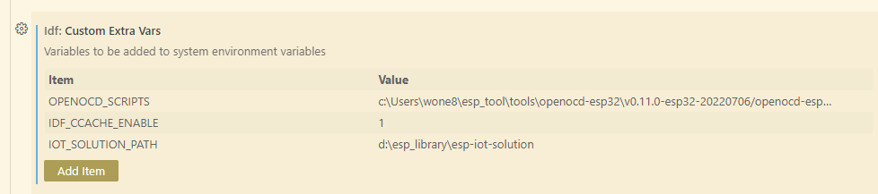

# 1. BLUFI 编译报错找不到相关文件
- IDF V4.4.3 需要使用blufi， 必须 ENABLE BLE 4.2 features.
-----------------

# 2.VSCode 插件报错
报错信息提示 However, the component manager is not enabled.

这个是 vscode 插件默认没有使能component manager导致的，插件未来会升级，默认会打开这个选项。

暂且你可以 在 .vscode/setting.json 中加上这行：`"idf.enableIdfComponentManager": true`

---------------------------------------------------


# 3.将ESP32的GPIO11配置为管脚
ESP32C3的GPIO11(VDD_SPI)默认功能是给flash供电，这个开发板（能不能烧看原理图）VDD直接接3.3，所以可以将此IO用作GPIO，以下是操作流程，注意以下的操作只能执行一次，更改后不能复原（因为是设置熔丝位，不是寄存器，一次性操作）。  

1、使用python的pip安装esptool。pip install esptool 
2、将开发板插入电脑 
3、打开命令行窗口输入espefuse.py -p 端口 burn_efuse VDD_SPI_AS_GPIO 1 
4、看提示，输入'BURN'

--------------------


# 4.将 IOT_SOLUTION 组件添加到工程
``git clone --recursive https://github.com/espressif/esp-iot-solution``

将 esp_iot_solution 添加到系统环境变量, 在CMD窗口运行
```
set IOT_SOLUTION_PATH=C:\esp\esp-iot-solution
```

然后在工程的 CMakeLists.txt 中添加该组件 `include($ENV{IOT_SOLUTION_PATH}/component.cmake)` 

或者，只添加某一组件 
```
set(EXTRA_COMPONENT_DIRS "${EXTRA_COMPONENT_DIRS} $ENV{IOT_SOLUTION_PATH}/components/{component_you_choose}")
``` 

如果需要对组件进行魔改，那么直接将组件复制到工程的 components 文件夹后使用。

现在的VSCode 插件可以在配置里面添加 PATH 路径了


---------------------

# 5. idf.py 构建工具
### 一键完成构建，烧录， log
`idf.py -p COMx clean flash monitor`

### 创建新组件
`idf.py -C components create-component my_component`


----------------------------


# 6. Newlib->formatting(可能影响int64_t数据打印)
ESP32中默认启用了nano formatting，在打印int64_t时可能会产生问题。需要到menuconfig中关闭。

---------------------------
