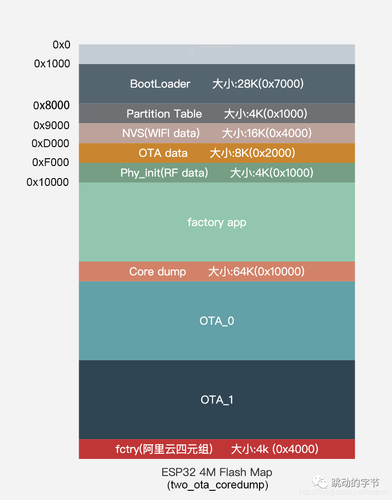

每片 ESP32 的 flash 可以包含多个应用程序，以及多种不同类型的数据（例如校准数据、文件系统数据、参数存储数据等）。因此，我们在 flash 的 [默认偏移地址](https://docs.espressif.com/projects/esp-idf/zh_CN/stable/esp32/api-reference/kconfig.html#config-partition-table-offset) 0x8000 处烧写一张分区表。

分区表的长度为 0xC00 字节（最多可以保存 95 条分区表条目）。分区表数据后还保存着该表的 MD5 校验和，用于验证分区表的完整性。此外，如果芯片使能了 [安全启动](https://docs.espressif.com/projects/esp-idf/zh_CN/stable/esp32/security/secure-boot-v2.html) 功能，则该分区表后还会保存签名信息。

程序boot时打印的partition table
```
I (56) boot: Partition Table:
I (60) boot: ## Label            Usage          Type ST Offset   Length
I (67) boot:  0 nvs              WiFi data        01 02 00009000 00004000
I (75) boot:  1 otadata          OTA data         01 00 0000d000 00002000
I (82) boot:  2 phy_init         RF data          01 01 0000f000 00001000
I (90) boot:  3 ble_mesh         WiFi data        01 02 00010000 00040000
I (97) boot:  4 factory          factory app      00 00 00050000 003b0000
I (105) boot: End of partition table
```

用户分区表
```
# Name,         Type,   SubType,    Offset,     Size,   Flags
nvs,            data,   nvs,        0x9000,     16k
otadata,        data,   ota,        0xd000,     8k
phy_init,       data,   phy,        0xf000,     4k
ble_mesh,       data,   nvs,        0x10000,    256k
factory,        app,    factory,    0x50000,    3776k
```

实际上，引导加载程序(bootloader)位于 flash 的 0x1000 偏移地址处, 分区表(partition-table)位于0x8000处.

可以参考下面的分区表。
