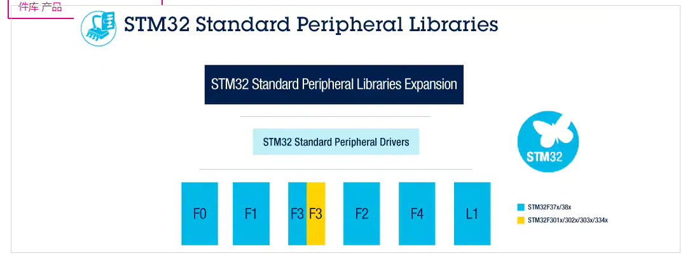

# 为什么还要使用标准库？
主要是国内一众厂商目前提供的SDK和ST标准库的写法更加相似。加上最近ST更新了STM32F1的标准库，目前正好有某些方面的需求，重新学习一下。

# ST标准库的下载
点开[这个链接](https://www.st.com/zh/embedded-software/stm32-standard-peripheral-libraries.html?querycriteria=productId=LN1939)，然后再图片中选择对应的系列的MCU，填写邮箱等信息之后，会将下载链接以邮件的形式发出。目前的最新版本是 V3.6.0


# 编译工程
下载过来之后，直接打开目录`en.stsw-stm32054_v3-6-0\STM32F10x_StdPeriph_Lib_V3.6.0\Project\STM32F10x_StdPeriph_Template\MDK-ARM`  下的工程文件，应该是可以正常编译通过的。一般情况下，拿这个工程根据你的板子定义进行修改也都够用了。


# 新建工程的方式
新建工程的方式有很多种，可以直接使用Keil新建工程，然后根据选择需要的包就好，但是这样不仅要求一个国际标准的互联网连接，建出来的工程可能其他人无法很好地使用。

我们通过将CMSIS源文件与StdPeriph_Lib库文件添加到自己工程的方式进行新建工程。这样新建出来的工程的缺点是当CMSIS或者StdPeriph_Lib升级之后，需要手动替换这些文件。
建好的工程目录如下
```
+---CMSIS
|   \---5.8.0
|       +---CMSIS
|                                   
+---Project
|   |   Project.sct
|   |   Project.uvoptx
|   |   Project.uvprojx
|   |       
|   \---Objects
|
+---Startup
|       startup_stm32f10x_hd.s
|       
+---STM32F10x_StdPeriph_Driver
|           
\---User
        main.c
        stm32f10x.h
        stm32f10x_conf.h
        stm32f10x_it.c
        stm32f10x_it.h
        system_stm32f10x.c
        system_stm32f10x.h
```

其中 CMSIS 文件夹从Keil的安装目录中复制；Project目录为Keil的工程目录；Startup文件夹只需要放对于的 startup_xxx.s 启动文件即可；STM32F10x_StdPeriph_Driver为标准库。

_从Keil中复制CMSIS的目的是使工程支持AC6编译。_


# 启动文件分析

先列举部分汇编指令的含义
| 指令      | 含义                                                                                                                                                                         |
| --------- | ---------------------------------------------------------------------------------------------------------------------------------------------------------------------------- |
| EQU       | The `EQU` directive gives a symbolic name to a numeric constant, a register-relative value or a PC-relative value.</br> 相当于给一个变量起了一个名字，类似于#define的作用    |
| AREA      | The `AREA` directive instructs the assembler to assemble a new code or data section. </br>指示汇编器汇编一个新的代码段或者数据段                                             |
| SPACE     | The `SPACE` directive reserves a zeroed block of memory. </br>指示保留一个用0填充的内存块                                                                                    |
| ALIGN     | The `ALIGN` directive aligns the current location to a specified boundary by padding with zeros or `NOP` instructions. </br>用0或者`NOP`进行填充，使当前位置与指定的边界对齐 |
| PRESERVE8 | 指定当前文件保持栈的8字节对齐                                                                                                                                                |
| THUMB     |                                                                                                                                                                              |
| EXPORT    | 声明一个符号，可以由链接器用于解释哥哥目标和库文件中的符号引用，相当于声明了一个全局变量                                                                                     |
| DCD       | 分配一个或多个字节的存储器，在四个字节的边界上对齐，并定义存储器运行时的初值                                                                                                 |
| PROC      | 用于标记函数入口                                                                                                                                                             |
| WEAK      | 表示只有当没有其他源导出另一个实例时，才应将此符号的实例导入其他源中                                                                                                         |
| IMPORT    | 如果在当前的汇编代码中未找到其他的引用，则不导入该名称                                                                                                                       |
| ENDP      | 用于标记一个与AAPCS兼容的函数的结束                                                                                                                                          |
| IF        | 引入一个条件，用于决定是否汇编一个指令序列                                                                                                                                   |
| ELSE      | 标记一个指令序列的开始，如果不满足IF的条件，则汇编该序列                                                                                                                     |
| ENDIF     | 标记一个要进行条件汇编的指令序列的结束                                                                                                                                       |
| END       | 指示汇编器，已到达一个文件的末尾                                                                                                                                             | 


可以在Keil中选中指令，然后按F1 调出对应的指令说明文档。

查看startup_stm32f10x_xxx.s 启动文件， 可以看到复位后的流程如下。
```asm
Stack_Size      EQU     0x00000400
;定义了一个数值常量符号 Stack_Size，指明栈大小为0x400,

                AREA    STACK, NOINIT, READWRITE, ALIGN=3
;定义了一个未初始化，可以读写并要求8字节边界对齐的段，段名,为STACK                

Stack_Mem       SPACE   Stack_Size
;定义一个初始化为0的存储块Stack_Mem

__initial_sp
;表示栈的结束地址，即栈顶地址，栈是由高向低生长的
                                                  
; <h> Heap Configuration
;   <o>  Heap Size (in Bytes) <0x0-0xFFFFFFFF:8>
; </h>

Heap_Size       EQU     0x00000200
;定义了堆的大小
                AREA    HEAP, NOINIT, READWRITE, ALIGN=3
;定义了一个要求8字节对齐的段，段名为HEAP

__heap_base
;指明堆起始地址
Heap_Mem        SPACE   Heap_Size
;初始化堆存储块
__heap_limit
;堆结束地址，堆由低向高生长

                PRESERVE8
;指明当前文件的堆栈按照8字节对齐

                THUMB
;将随后的指令解析为16位的Thumb指令

;;初始化中断向量表
; Vector Table Mapped to Address 0 at Reset
                AREA    RESET, DATA, READONLY
                EXPORT  __Vectors
                EXPORT  __Vectors_End
                EXPORT  __Vectors_Size
;三个只读数据段，向量表开始，向量表结束，向量表大小。使用EXPORT指明其拥有全局性

__Vectors       DCD     __initial_sp               ; Top of Stack
                DCD     Reset_Handler              ; Reset Handler
;这两行表示向量表开始在栈顶，Reset_Handler被分配到栈顶的位置。                
                DCD     NMI_Handler                ; NMI Handler
                DCD     HardFault_Handler          ; Hard Fault Handler
                DCD     MemManage_Handler          ; MPU Fault Handler
                DCD     BusFault_Handler           ; Bus Fault Handler
                DCD     UsageFault_Handler         ; Usage Fault Handler
                DCD     0                          ; Reserved
                DCD     0                          ; Reserved
                DCD     0                          ; Reserved
                DCD     0                          ; Reserved
                DCD     SVC_Handler                ; SVCall Handler
                DCD     DebugMon_Handler           ; Debug Monitor Handler
                DCD     0                          ; Reserved
                DCD     PendSV_Handler             ; PendSV Handler
                DCD     SysTick_Handler            ; SysTick Handler

                ; External Interrupts
                DCD     WWDG_IRQHandler            ; Window Watchdog
                DCD     PVD_IRQHandler             ; PVD through EXTI Line detect
                DCD     TAMPER_IRQHandler          ; Tamper
                DCD     RTC_IRQHandler             ; RTC
                DCD     FLASH_IRQHandler           ; Flash
                DCD     RCC_IRQHandler             ; RCC
                DCD     EXTI0_IRQHandler           ; EXTI Line 0
                DCD     EXTI1_IRQHandler           ; EXTI Line 1
                DCD     EXTI2_IRQHandler           ; EXTI Line 2
                DCD     EXTI3_IRQHandler           ; EXTI Line 3
                DCD     EXTI4_IRQHandler           ; EXTI Line 4
                DCD     DMA1_Channel1_IRQHandler   ; DMA1 Channel 1
                DCD     DMA1_Channel2_IRQHandler   ; DMA1 Channel 2
                DCD     DMA1_Channel3_IRQHandler   ; DMA1 Channel 3
                DCD     DMA1_Channel4_IRQHandler   ; DMA1 Channel 4
                DCD     DMA1_Channel5_IRQHandler   ; DMA1 Channel 5
                DCD     DMA1_Channel6_IRQHandler   ; DMA1 Channel 6
                DCD     DMA1_Channel7_IRQHandler   ; DMA1 Channel 7
                DCD     ADC1_2_IRQHandler          ; ADC1 & ADC2
                DCD     USB_HP_CAN1_TX_IRQHandler  ; USB High Priority or CAN1 TX
                DCD     USB_LP_CAN1_RX0_IRQHandler ; USB Low  Priority or CAN1 RX0
                DCD     CAN1_RX1_IRQHandler        ; CAN1 RX1
                DCD     CAN1_SCE_IRQHandler        ; CAN1 SCE
                DCD     EXTI9_5_IRQHandler         ; EXTI Line 9..5
                DCD     TIM1_BRK_IRQHandler        ; TIM1 Break
                DCD     TIM1_UP_IRQHandler         ; TIM1 Update
                DCD     TIM1_TRG_COM_IRQHandler    ; TIM1 Trigger and Commutation
                DCD     TIM1_CC_IRQHandler         ; TIM1 Capture Compare
                DCD     TIM2_IRQHandler            ; TIM2
                DCD     TIM3_IRQHandler            ; TIM3
                DCD     TIM4_IRQHandler            ; TIM4
                DCD     I2C1_EV_IRQHandler         ; I2C1 Event
                DCD     I2C1_ER_IRQHandler         ; I2C1 Error
                DCD     I2C2_EV_IRQHandler         ; I2C2 Event
                DCD     I2C2_ER_IRQHandler         ; I2C2 Error
                DCD     SPI1_IRQHandler            ; SPI1
                DCD     SPI2_IRQHandler            ; SPI2
                DCD     USART1_IRQHandler          ; USART1
                DCD     USART2_IRQHandler          ; USART2
                DCD     USART3_IRQHandler          ; USART3
                DCD     EXTI15_10_IRQHandler       ; EXTI Line 15..10
                DCD     RTCAlarm_IRQHandler        ; RTC Alarm through EXTI Line
                DCD     USBWakeUp_IRQHandler       ; USB Wakeup from suspend
                DCD     TIM8_BRK_IRQHandler        ; TIM8 Break
                DCD     TIM8_UP_IRQHandler         ; TIM8 Update
                DCD     TIM8_TRG_COM_IRQHandler    ; TIM8 Trigger and Commutation
                DCD     TIM8_CC_IRQHandler         ; TIM8 Capture Compare
                DCD     ADC3_IRQHandler            ; ADC3
                DCD     FSMC_IRQHandler            ; FSMC
                DCD     SDIO_IRQHandler            ; SDIO
                DCD     TIM5_IRQHandler            ; TIM5
                DCD     SPI3_IRQHandler            ; SPI3
                DCD     UART4_IRQHandler           ; UART4
                DCD     UART5_IRQHandler           ; UART5
                DCD     TIM6_IRQHandler            ; TIM6
                DCD     TIM7_IRQHandler            ; TIM7
                DCD     DMA2_Channel1_IRQHandler   ; DMA2 Channel1
                DCD     DMA2_Channel2_IRQHandler   ; DMA2 Channel2
                DCD     DMA2_Channel3_IRQHandler   ; DMA2 Channel3
                DCD     DMA2_Channel4_5_IRQHandler ; DMA2 Channel4 & Channel5
__Vectors_End

__Vectors_Size  EQU  __Vectors_End - __Vectors
;向量表定义结束

                AREA    |.text|, CODE, READONLY
				;定义了一个只读代码段
                
; Reset handler
Reset_Handler   PROC            ;PROC标记函数入口
                EXPORT  Reset_Handler             [WEAK]   
                ;因为没有其他地方定义Reset_Handler，这个函数就是Reset_Handler的实例
                IMPORT  __main
                IMPORT  SystemInit
                ;导入main和SystemInit
                LDR     R0, =SystemInit
                ;LDR,从存储器加载字到一个寄存器，加载SystemInit到R0
                BLX     R0               
                ;BLX, 跳转到寄存器给出的地址，并根据LSE确定处理器的状态，还要把跳转前的下条指令地址保存到LR
                LDR     R0, =__main
                ; 加载___main到R0
                BX      R0
                ;BX, 跳转到寄存器给出的地址，不用返回
                ENDP   ;函数结束
                
; Dummy Exception Handlers (infinite loops which can be modified)

NMI_Handler     PROC
                EXPORT  NMI_Handler                [WEAK]
                B       .
                ENDP
HardFault_Handler\
                PROC
                EXPORT  HardFault_Handler          [WEAK]
                B       .
                ENDP
MemManage_Handler\
                PROC
                EXPORT  MemManage_Handler          [WEAK]
                B       .
                ENDP
BusFault_Handler\
                PROC
                EXPORT  BusFault_Handler           [WEAK]
                B       .
                ENDP
UsageFault_Handler\
                PROC
                EXPORT  UsageFault_Handler         [WEAK]
                B       .
                ENDP
SVC_Handler     PROC
                EXPORT  SVC_Handler                [WEAK]
                B       .
                ENDP
DebugMon_Handler\
                PROC
                EXPORT  DebugMon_Handler           [WEAK]
                B       .
                ENDP
PendSV_Handler  PROC
                EXPORT  PendSV_Handler             [WEAK]
                B       .
                ENDP
SysTick_Handler PROC
                EXPORT  SysTick_Handler            [WEAK]
                B       .
                ENDP

Default_Handler PROC

                EXPORT  WWDG_IRQHandler            [WEAK]
                EXPORT  PVD_IRQHandler             [WEAK]
                EXPORT  TAMPER_IRQHandler          [WEAK]
                EXPORT  RTC_IRQHandler             [WEAK]
                EXPORT  FLASH_IRQHandler           [WEAK]
                EXPORT  RCC_IRQHandler             [WEAK]
                EXPORT  EXTI0_IRQHandler           [WEAK]
                EXPORT  EXTI1_IRQHandler           [WEAK]
                EXPORT  EXTI2_IRQHandler           [WEAK]
                EXPORT  EXTI3_IRQHandler           [WEAK]
                EXPORT  EXTI4_IRQHandler           [WEAK]
                EXPORT  DMA1_Channel1_IRQHandler   [WEAK]
                EXPORT  DMA1_Channel2_IRQHandler   [WEAK]
                EXPORT  DMA1_Channel3_IRQHandler   [WEAK]
                EXPORT  DMA1_Channel4_IRQHandler   [WEAK]
                EXPORT  DMA1_Channel5_IRQHandler   [WEAK]
                EXPORT  DMA1_Channel6_IRQHandler   [WEAK]
                EXPORT  DMA1_Channel7_IRQHandler   [WEAK]
                EXPORT  ADC1_2_IRQHandler          [WEAK]
                EXPORT  USB_HP_CAN1_TX_IRQHandler  [WEAK]
                EXPORT  USB_LP_CAN1_RX0_IRQHandler [WEAK]
                EXPORT  CAN1_RX1_IRQHandler        [WEAK]
                EXPORT  CAN1_SCE_IRQHandler        [WEAK]
                EXPORT  EXTI9_5_IRQHandler         [WEAK]
                EXPORT  TIM1_BRK_IRQHandler        [WEAK]
                EXPORT  TIM1_UP_IRQHandler         [WEAK]
                EXPORT  TIM1_TRG_COM_IRQHandler    [WEAK]
                EXPORT  TIM1_CC_IRQHandler         [WEAK]
                EXPORT  TIM2_IRQHandler            [WEAK]
                EXPORT  TIM3_IRQHandler            [WEAK]
                EXPORT  TIM4_IRQHandler            [WEAK]
                EXPORT  I2C1_EV_IRQHandler         [WEAK]
                EXPORT  I2C1_ER_IRQHandler         [WEAK]
                EXPORT  I2C2_EV_IRQHandler         [WEAK]
                EXPORT  I2C2_ER_IRQHandler         [WEAK]
                EXPORT  SPI1_IRQHandler            [WEAK]
                EXPORT  SPI2_IRQHandler            [WEAK]
                EXPORT  USART1_IRQHandler          [WEAK]
                EXPORT  USART2_IRQHandler          [WEAK]
                EXPORT  USART3_IRQHandler          [WEAK]
                EXPORT  EXTI15_10_IRQHandler       [WEAK]
                EXPORT  RTCAlarm_IRQHandler        [WEAK]
                EXPORT  USBWakeUp_IRQHandler       [WEAK]
                EXPORT  TIM8_BRK_IRQHandler        [WEAK]
                EXPORT  TIM8_UP_IRQHandler         [WEAK]
                EXPORT  TIM8_TRG_COM_IRQHandler    [WEAK]
                EXPORT  TIM8_CC_IRQHandler         [WEAK]
                EXPORT  ADC3_IRQHandler            [WEAK]
                EXPORT  FSMC_IRQHandler            [WEAK]
                EXPORT  SDIO_IRQHandler            [WEAK]
                EXPORT  TIM5_IRQHandler            [WEAK]
                EXPORT  SPI3_IRQHandler            [WEAK]
                EXPORT  UART4_IRQHandler           [WEAK]
                EXPORT  UART5_IRQHandler           [WEAK]
                EXPORT  TIM6_IRQHandler            [WEAK]
                EXPORT  TIM7_IRQHandler            [WEAK]
                EXPORT  DMA2_Channel1_IRQHandler   [WEAK]
                EXPORT  DMA2_Channel2_IRQHandler   [WEAK]
                EXPORT  DMA2_Channel3_IRQHandler   [WEAK]
                EXPORT  DMA2_Channel4_5_IRQHandler [WEAK]

WWDG_IRQHandler
PVD_IRQHandler
TAMPER_IRQHandler
RTC_IRQHandler
FLASH_IRQHandler
RCC_IRQHandler
EXTI0_IRQHandler
EXTI1_IRQHandler
EXTI2_IRQHandler
EXTI3_IRQHandler
EXTI4_IRQHandler
DMA1_Channel1_IRQHandler
DMA1_Channel2_IRQHandler
DMA1_Channel3_IRQHandler
DMA1_Channel4_IRQHandler
DMA1_Channel5_IRQHandler
DMA1_Channel6_IRQHandler
DMA1_Channel7_IRQHandler
ADC1_2_IRQHandler
USB_HP_CAN1_TX_IRQHandler
USB_LP_CAN1_RX0_IRQHandler
CAN1_RX1_IRQHandler
CAN1_SCE_IRQHandler
EXTI9_5_IRQHandler
TIM1_BRK_IRQHandler
TIM1_UP_IRQHandler
TIM1_TRG_COM_IRQHandler
TIM1_CC_IRQHandler
TIM2_IRQHandler
TIM3_IRQHandler
TIM4_IRQHandler
I2C1_EV_IRQHandler
I2C1_ER_IRQHandler
I2C2_EV_IRQHandler
I2C2_ER_IRQHandler
SPI1_IRQHandler
SPI2_IRQHandler
USART1_IRQHandler
USART2_IRQHandler
USART3_IRQHandler
EXTI15_10_IRQHandler
RTCAlarm_IRQHandler
USBWakeUp_IRQHandler
TIM8_BRK_IRQHandler
TIM8_UP_IRQHandler
TIM8_TRG_COM_IRQHandler
TIM8_CC_IRQHandler
ADC3_IRQHandler
FSMC_IRQHandler
SDIO_IRQHandler
TIM5_IRQHandler
SPI3_IRQHandler
UART4_IRQHandler
UART5_IRQHandler
TIM6_IRQHandler
TIM7_IRQHandler
DMA2_Channel1_IRQHandler
DMA2_Channel2_IRQHandler
DMA2_Channel3_IRQHandler
DMA2_Channel4_5_IRQHandler
                B       .

                ENDP

                ALIGN

;*******************************************************************************
; User Stack and Heap initialization 用户堆栈初始化
;*******************************************************************************
                 IF      :DEF:__MICROLIB   ;microlib
                
                 EXPORT  __initial_sp      ;定义栈顶地址
                 EXPORT  __heap_base       ;定义堆起始地址
                 EXPORT  __heap_limit      ;定义堆结束地址
                
                 ELSE
                
                 IMPORT  __use_two_region_memory     ;使用双端模式，一部分储存于用于栈，其他用于堆，堆空间可以为0，如果堆为0则无法使用malloc()进行内存分配
                 EXPORT  __user_initial_stackheap    ;执行下面的代码初始化堆栈
                 
__user_initial_stackheap

                 LDR     R0, =  Heap_Mem
                 LDR     R1, =(Stack_Mem + Stack_Size)
                 LDR     R2, = (Heap_Mem +  Heap_Size)
                 LDR     R3, = Stack_Mem
                 BX      LR                 ;将堆栈的参数放入R0~R4,然后跳转到__main，由编译器提供的__main来调用。

                 ALIGN

                 ENDIF

                 END
```

其实可以看文件头部对于这个启动文件的说明，也是非常清晰的
	- Set the initial SP
	;*                      - Set the initial PC == Reset_Handler
	;*                      - Set the vector table entries with the exceptions ISR address
	;*                      - Configure the clock system and also configure the external 
	;*                        SRAM mounted on STM3210E-EVAL board to be used as data 
	;*                        memory (optional, to be enabled by user)
	;*                      - Branches to \_\_main in the C library (which eventually
	;*                        calls main()).
	;*                      After Reset the CortexM3 processor is in Thread mode,
	;*                      priority is Privileged, and the Stack is set to Main.


# SystemInit函数
```C
/**
  * @brief  Setup the microcontroller system
  *         Initialize the Embedded Flash Interface, the PLL and update the 
  *         SystemCoreClock variable.
  * @note   This function should be used only after reset.
  * @param  None
  * @retval None
  */
void SystemInit (void)
{
  /* Reset the RCC clock configuration to the default reset state(for debug purpose) */
  /* Set HSION bit */
  RCC->CR |= (uint32_t)0x00000001;

  /* Reset SW, HPRE, PPRE1, PPRE2, ADCPRE and MCO bits */
#ifndef STM32F10X_CL
  RCC->CFGR &= (uint32_t)0xF8FF0000;
#else
  RCC->CFGR &= (uint32_t)0xF0FF0000;
#endif /* STM32F10X_CL */   
  
  /* Reset HSEON, CSSON and PLLON bits */
  /* 清除HSEON, CSSON, PLLON位 */
  /* CSSON: Clock security system enable */
  RCC->CR &= (uint32_t)0xFEF6FFFF;

  /* Reset HSEBYP bit */
  /* HSEBYP: External high-speed clock bypass */
  RCC->CR &= (uint32_t)0xFFFBFFFF;

  /* Reset PLLSRC, PLLXTPRE, PLLMUL and USBPRE/OTGFSPRE bits */
  RCC->CFGR &= (uint32_t)0xFF80FFFF;

#ifdef STM32F10X_CL
  /* Reset PLL2ON and PLL3ON bits */
  RCC->CR &= (uint32_t)0xEBFFFFFF;

  /* Disable all interrupts and clear pending bits  */
  RCC->CIR = 0x00FF0000;

  /* Reset CFGR2 register */
  RCC->CFGR2 = 0x00000000;
#elif defined (STM32F10X_LD_VL) || defined (STM32F10X_MD_VL) || (defined STM32F10X_HD_VL)
  /* Disable all interrupts and clear pending bits  */
  RCC->CIR = 0x009F0000;

  /* Reset CFGR2 register */
  RCC->CFGR2 = 0x00000000;      
#else
  /* Disable all interrupts and clear pending bits  */
  RCC->CIR = 0x009F0000;
#endif /* STM32F10X_CL */
    
#if defined (STM32F10X_HD) || (defined STM32F10X_XL) || (defined STM32F10X_HD_VL)
  #ifdef DATA_IN_ExtSRAM
    SystemInit_ExtMemCtl(); 
  #endif /* DATA_IN_ExtSRAM */
#endif 

  /* Configure the System clock frequency, HCLK, PCLK2 and PCLK1 prescalers */
  /* Configure the Flash Latency cycles and enable prefetch buffer */
  SetSysClock();

#ifdef VECT_TAB_SRAM
  SCB->VTOR = SRAM_BASE | VECT_TAB_OFFSET; /* Vector Table Relocation in Internal SRAM. */
#else
  SCB->VTOR = FLASH_BASE | VECT_TAB_OFFSET; /* Vector Table Relocation in Internal FLASH. */
#endif 
}
```

下面是将SYSCLK设置到72MHz的操作
```
static void SetSysClockTo72(void)
{
  __IO uint32_t StartUpCounter = 0, HSEStatus = 0;
  
  /* SYSCLK, HCLK, PCLK2 and PCLK1 configuration ---------------------------*/    
  /* Enable HSE */    
  RCC->CR |= ((uint32_t)RCC_CR_HSEON);
 
  /* Wait till HSE is ready and if Time out is reached exit */
  do
  {
    HSEStatus = RCC->CR & RCC_CR_HSERDY;
    StartUpCounter++;  
  } while((HSEStatus == 0) && (StartUpCounter != HSE_STARTUP_TIMEOUT));

  if ((RCC->CR & RCC_CR_HSERDY) != RESET)
  {
    HSEStatus = (uint32_t)0x01;
  }
  else
  {
    HSEStatus = (uint32_t)0x00;
  }  

  if (HSEStatus == (uint32_t)0x01)
  {
	/* HSE 初始化成功 */
	 
    /* Enable Prefetch Buffer 使能预取缓存区 */
    /* FLASH_ACR_PRFTBE: 0x10, */
    FLASH->ACR |= FLASH_ACR_PRFTBE;

    /* Flash 2 wait state */
    /* Flash 两个等待周期，因为主频是72MHz, Flash只有24MHz */
    FLASH->ACR &= (uint32_t)((uint32_t)~FLASH_ACR_LATENCY);
    FLASH->ACR |= (uint32_t)FLASH_ACR_LATENCY_2;    

 
    /* HCLK = SYSCLK */
    RCC->CFGR |= (uint32_t)RCC_CFGR_HPRE_DIV1;
      
    /* PCLK2 = HCLK */
    RCC->CFGR |= (uint32_t)RCC_CFGR_PPRE2_DIV1;
    
    /* PCLK1 = HCLK */
    RCC->CFGR |= (uint32_t)RCC_CFGR_PPRE1_DIV2;

#ifdef STM32F10X_CL
    /* Configure PLLs ------------------------------------------------------*/
    /* PLL2 configuration: PLL2CLK = (HSE / 5) * 8 = 40 MHz */
    /* PREDIV1 configuration: PREDIV1CLK = PLL2 / 5 = 8 MHz */
        
    RCC->CFGR2 &= (uint32_t)~(RCC_CFGR2_PREDIV2 | RCC_CFGR2_PLL2MUL |
                              RCC_CFGR2_PREDIV1 | RCC_CFGR2_PREDIV1SRC);
    RCC->CFGR2 |= (uint32_t)(RCC_CFGR2_PREDIV2_DIV5 | RCC_CFGR2_PLL2MUL8 |
                             RCC_CFGR2_PREDIV1SRC_PLL2 | RCC_CFGR2_PREDIV1_DIV5);
  
    /* Enable PLL2 */
    RCC->CR |= RCC_CR_PLL2ON;
    /* Wait till PLL2 is ready */
    while((RCC->CR & RCC_CR_PLL2RDY) == 0)
    {
    }
    
   
    /* PLL configuration: PLLCLK = PREDIV1 * 9 = 72 MHz */ 
    RCC->CFGR &= (uint32_t)~(RCC_CFGR_PLLXTPRE | RCC_CFGR_PLLSRC | RCC_CFGR_PLLMULL);
    RCC->CFGR |= (uint32_t)(RCC_CFGR_PLLXTPRE_PREDIV1 | RCC_CFGR_PLLSRC_PREDIV1 | 
                            RCC_CFGR_PLLMULL9); 
#else    
    /*  PLL configuration: PLLCLK = HSE * 9 = 72 MHz */
    RCC->CFGR &= (uint32_t)((uint32_t)~(RCC_CFGR_PLLSRC | RCC_CFGR_PLLXTPRE |
                                        RCC_CFGR_PLLMULL));
    RCC->CFGR |= (uint32_t)(RCC_CFGR_PLLSRC_HSE | RCC_CFGR_PLLMULL9);
#endif /* STM32F10X_CL */

    /* Enable PLL */
    RCC->CR |= RCC_CR_PLLON;

    /* Wait till PLL is ready */
    while((RCC->CR & RCC_CR_PLLRDY) == 0)
    {
    }
    
    /* Select PLL as system clock source */
    RCC->CFGR &= (uint32_t)((uint32_t)~(RCC_CFGR_SW));
    RCC->CFGR |= (uint32_t)RCC_CFGR_SW_PLL;    

    /* Wait till PLL is used as system clock source */
    while ((RCC->CFGR & (uint32_t)RCC_CFGR_SWS) != (uint32_t)0x08)
    {
    }
  }
  else
  { /* If HSE fails to start-up, the application will have wrong clock 
         configuration. User can add here some code to deal with this error */
    /* HSE初始化失败 */
  }
}
```

最后一步是 向 SCB->VTOR 寄存器写入中断向量表的地址。

