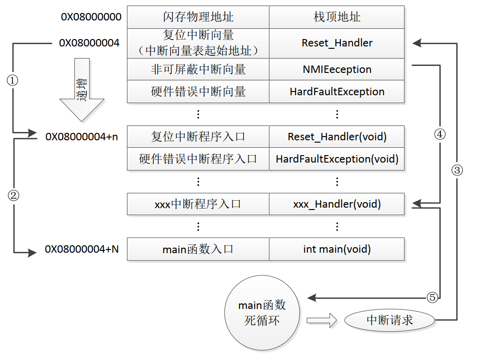
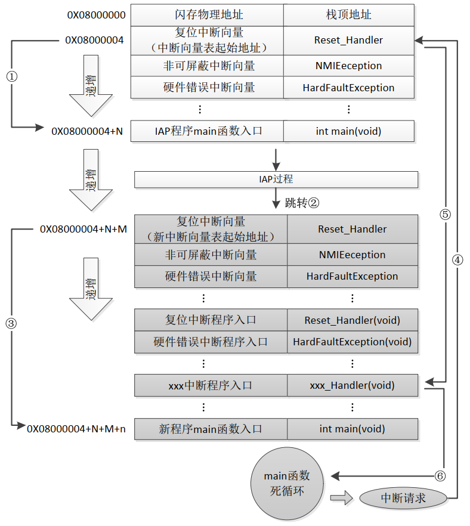
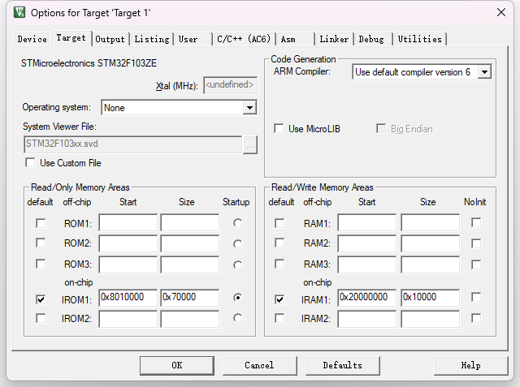

暂时忘掉上面移植的FreeRTOS.
建立一个裸机工程作为uboot.

# IAP(In Application Programming)
要实现IAP，则必须将程序分为 bootloader 和 application 两个部分，bootloader 程序负责通过某种通讯方式接收固件，执行对 application 分区的更新。application 分区则是真正意义上的代码功能。
芯片上电后，会运行到 bootloader 程序， bootloader 程序执行以下操作。
1. 检查是否需要对第二部分的代码进行更新。
2. 如果不需要更新，跳转到 4.
3. 执行更新操作(接收数据，校验等等工作)
4. 跳转到 application 。

所以， bootloader 部分程序一般需要通过 烧录器 或者 ISP 进行烧录，第二部分代码则可以使用 bootloader 的 IAP 功能烧录，或者直接使用 烧录器 或 ISP 进行烧录也可以。

STM32 内部的 Flash 地址起始于 0x08000000，一般情况下，程序文件就从这个地址开始写入。此外 STM32 是基于 Cortex-M3 内核的微控制器，其内部通过一张“中断向量表”来响应中断，程序启动后，将首先从“中断向量表”取出复位中断向量执行复位中断程序完成启动，而这张“中断向量表”的起始地址是 0x08000004，当中断来临， STM32 的内部硬件机制亦会自动将 PC 指针定位到“中断向量表”处，并根据中断源取出对应的中断向量执行中断服务程序。

# 正常程序执行流程


**STM32 正常运行流程图**
-  STM32 在复位后，先从 0X08000004 地址取出复位中断向量的地址，并跳转到复位中断服务程序① 。
- 在复位中断服务程序执行完成之后，执行②， 跳转到 `main()` 函数。_实际上，会先跳转到 `SystemInit()` , 然后是 `__main()`，再接下来才是  `main()` 函数， 上图省略了部分过程。_
- 接下来就是在 `main()` 中执行用户代码，如果遇到中断请求，则会将 PC 指针指向中断向量表，如③所示，然后根据中断源进入对应的中断服务函数④，中断服务函数执行完成后，再次返回 `main()` 函数⑤。


# 加入 IAP 的程序执行流程

**STM32 加入 IAP 之后的程序运行流程图**
-  STM32 在复位后，先从 0X08000004 地址取出复位中断向量的地址，并跳转到复位中断服务程序① 。
- 在执行完成复位中断服务函数之后，会跳转到 bootloader 中的`main()` 函数(_省略部分流程_)。
- 在 bootloader 的 IAP 程序执行完成之后(_无论是否需要更新 app，都将会跳转到 application 分区_)，跳转到 application 分区的 **中断向量表**， 并从 中断向量表 中取出 复位中断向量的地址，跳转到 application 分区的复位中断服务函数②。
- 然后会跳转至 application 分区的 `main()` 函数③
- 在 `main()`  函数中，如果产生了中断请求，PC 指针将仍然跳转到 0x08000004 中断向量表处④，然后根据 **新的中断向量表偏移量**，跳转到 application 区的中断服务函数⑤，中断服务函数指向完成后，跳转回 `main()` 函数⑥。

# Application 程序起始地址设置
根据加入了 IAP 之后的程序流程图可知，此时 Flash 中需要保存**两个中断向量表**。分别用于bootloader 程序与 application 程序。
由于上电之后是先执行 bootloader 程序，所以，bootloader 程序的起始地址就是 0x08000000。
application 分区的起始地址就是 bootloader 分区的起始地址 加上一个 偏移量， 这个偏移量 就是 bootloader 的大小。

假设 bootloader 程序大小设置为 64KB， 那么 application 程序的起始地址就是 0x08000000 + 0x10000(64KB)。

**Keil 中设置 程序起始地址与大小(Flash App)**

将 IROM1 的 Start 设置为 0x8010000，Size 则为剩余的扇区大小 0x70000 (448KB)。

**SRAM App 的相关设置**
如果是SRAM App，则需要将 IROM1 的地址设置为 0x20001000， 大小为 0xC000(48KB)；  IRAM1 的起始地址为 0x20001000 + 0xC000 = 0x2000D000, 因为STM32F103ZET6的的 SRAM 大小为 64字节，所以 IRAM1 的大小为剩余的12字节空间 0x3000。
所以， 整个 SRAM 的分配情况如下：
| 用途       | 起始地址   | 大小         | 注释                  |
| ---------- | ---------- | ------------ | --------------------- |
| bootloader | 0x20000000 | 0x1000(4KB)  | 存放 bootloader 程序  |
| IROM1      | 0x20001000 | 0xC000(48KB) | 存放 application 程序 |
| IRAM1      | 0x2000D000 | 0x3000(12KB) | 程序执行时使用的 SRAM | 


# 中断向量表偏移量 设置方法
首先，复位中断执行完成后首先调用的是 `SystemInit()` 这个函数，该函数先设置系统时钟，最后向 SCB->VTOR 这个寄存器写入中断向量表的地址。
**该程序的最后几行就是用于设置中断向量表的**
```
#ifdef VECT_TAB_SRAM
  SCB->VTOR = SRAM_BASE | VECT_TAB_OFFSET; /* Vector Table Relocation in Internal SRAM. */
#else
  SCB->VTOR = FLASH_BASE | VECT_TAB_OFFSET; /* Vector Table Relocation in Internal FLASH. */
#endif 
```
在 bootloader 中，无需修改这个寄存器的值。
在 application 中，我们可以`SystemInit()`的尾部或者在`main()` 函数的第一句执行 修改这个寄存器的值 即可。


# bootloader 实现
**1. 内部 Flash 读写。**
	略
	
**2. 跳转 到 application 程序的起始地址。**
```
typedef void (*p_function)(void);       /* 函数指针 */
p_function jump_to_app;

void bl_load_application(uint32_t app_start_addr)
{
    /* 检查栈顶地址是否合法，确保栈顶地址在 SRAM 范围中(0x20000000 + 0x10000) */
    if(0x20000000 == ((*(volatile uint32_t*)app_start_addr) & 0x2FFE0000) )
    {
        /* 指向 application 程序的复位地址 */
        jump_to_app = (p_function)(*(volatile uint32_t*)(app_start_addr+4));
        /* 初始化堆栈指针，代码区的第一个字用于存放栈顶地址 */
        __set_MSP(*(volatile uint32_t*) app_start_addr);
        /* 跳转到 application 的 ResetHandler */
        jump_to_app();
    }
}
```

首先检查 application 固件的栈顶地址是否合法，固件中的前四个字节为栈顶地址；
然后跳转的 application 程序的 ResetHandler。


**3. 接收 application 程序，并写入对应地址(Ymodem)。**
_XShell 家庭版发送结束后， 又发了两个额外的字节(0x4F 0x4F)，导致bootloader没有正常跳转到 app。
SecureCRT 正常。_

1. 根据 Ymodem 协议， 收到起始帧之后，根据起始帧中的 文件大小信息擦除所需要写入的扇区。
2. 数据帧，按照 application 区的起始地址，写入并检查写入数据的正确性。
3. 收到结束帧后，跳转到 application.


