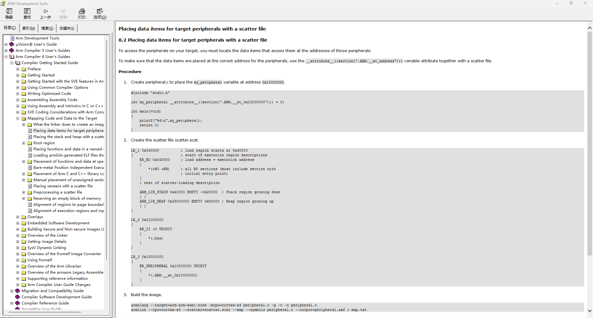

```
#if defined(__clang__)                /* AC6 */
#define DATA_AREA_ADDRESS_START         0x08002000
const char *board_name __attribute__((section(".ARM.__at_0x08002000"))) = "FK103M5";
const char *hw_version __attribute__((section(".ARM.__at_0x08002020"))) = "1.0.0";
const char *fw_version __attribute__((section(".ARM.__at_0x08002040"))) = "1.0.0";
const char *fw_build_time __attribute__((section(".ARM.__at_0x08002060"))) = __DATE__ " " __TIME__;
```

根据 AC6 开发手册.
