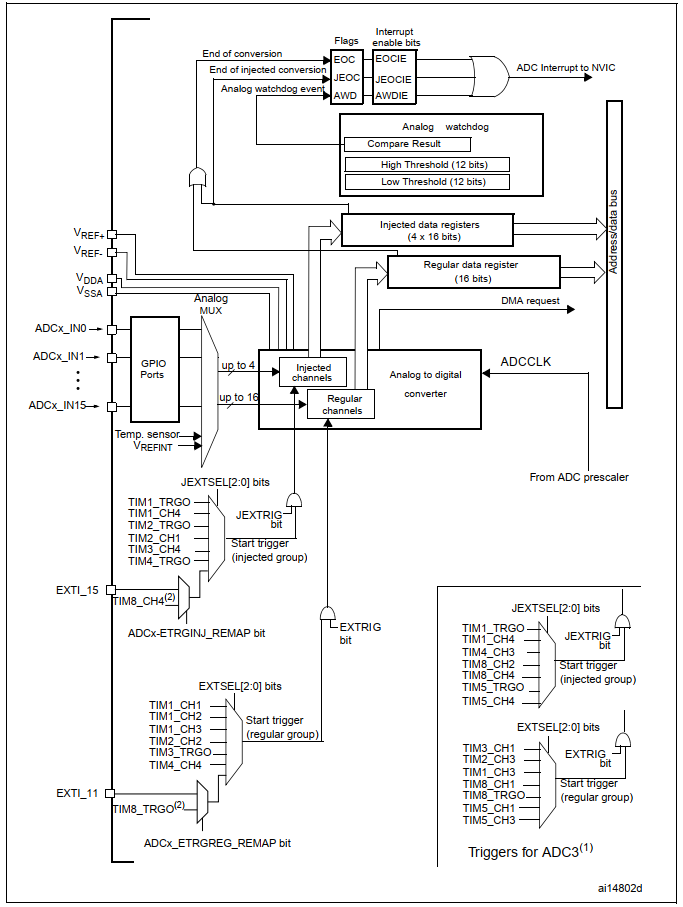
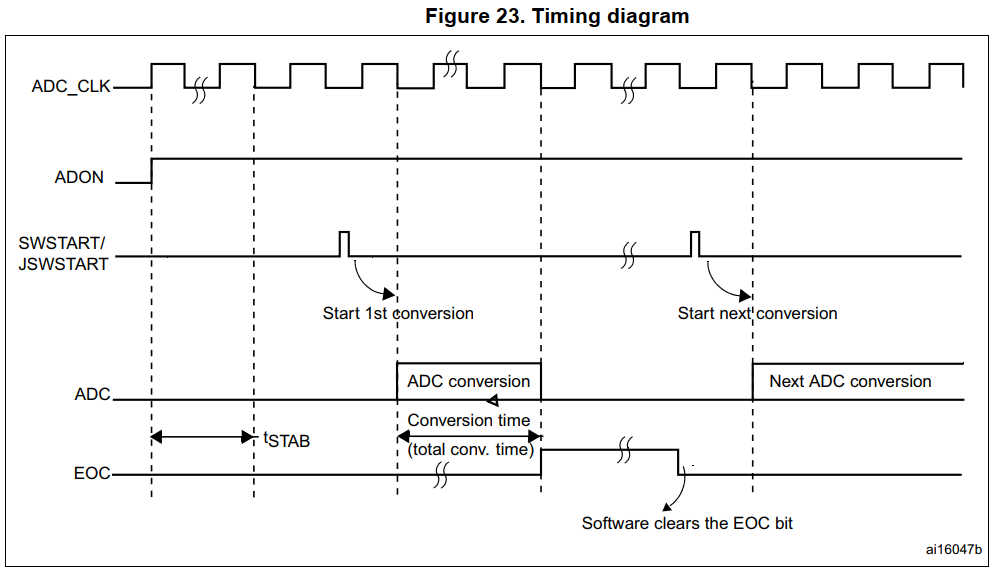
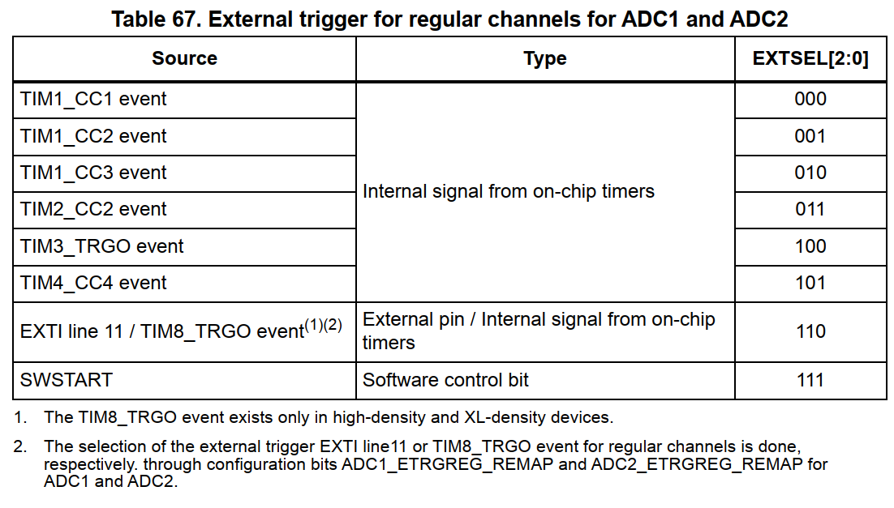
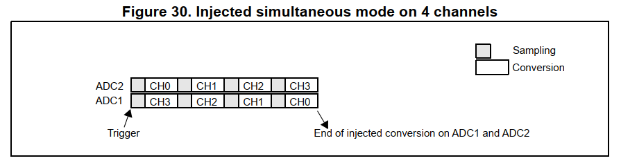
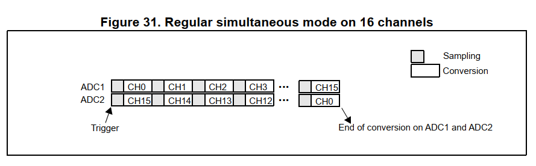
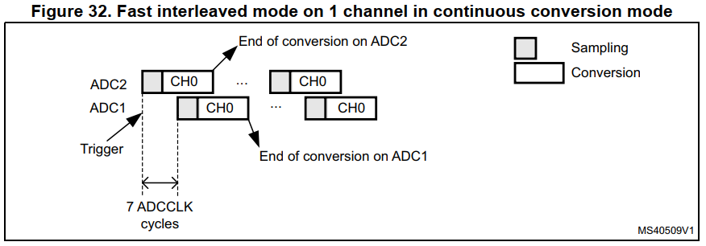
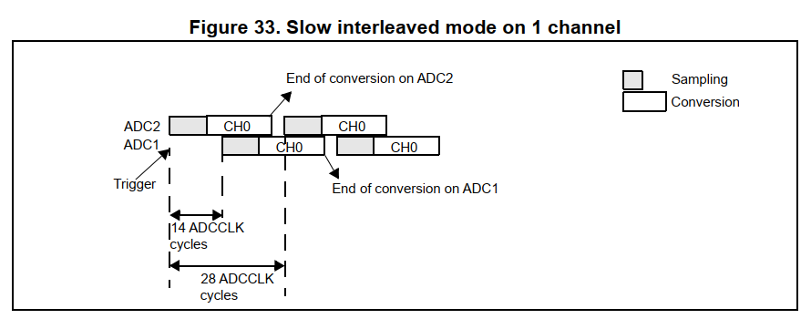

# 介绍
STM32F103 的 ADC 是一个 逐次逼近型 ADC。具有18个多路复用通道，可以测量16个外部输入信号和两个内部输入信号。各个通道可以以 单个、连续、扫描、或不连续的模式执行AD转换。ADC的结果存放在一个16位数据寄存器中，可以设置为左对齐或者右对齐。

模拟看门狗功能孕育应用检测输入电压是否超出用户定义的值。（高于或低于）

ADC 时钟来自于 PCLK2 分频，ADC 时钟最大不能超过 14MHz。

# 主要功能
- 12位分辨率
- 可以产生 转换结束、注入转换结束、或者模拟模拟看门狗事件 中断。
- 单个或者连续转换模式。
- 扫描模式，自动转换通道0~通道N
- 自校准
- 具有内置数据一致性的数据对齐
- 每个通道都可以单独配置采样时间。
- 规则转换和注入转换都可以配置外部触发源
- 不连续模式
- Dual mode (on devices with 2 ADCs or more)
- ADC 转换时间
	- STM32F103xx 1uS @ 56MHz， 1.17uS@72MHz
- ADC 供电电压 2.4~3.6V
- ADC 输入电压范围 VREF- ~ VREF+
- DMA request generation during regular channel conversion

_Note: Vref- if available(depending on package), must be tied to Vssa._

## 功能描述
_RM0008 Rev21 中的 figure22， ADC 的结构框图_

1. ADC3 的规则通道转换与注入通道转换的触发源与ADC1 ADC2 不一样
2. TIM8相关的触发源只有大容量芯片才有

注意 ： STM32 的 VDDA VSSA 分别连接到 VDD 与 VSS。所以采样范围只能是 VDD~VSS？

### ADC on-off control
ADC_CR2 的 ADON 位设置 ADC的开启与关闭；ADON 置位之后， ADC 将会在 **ADC启动时间(tSTAB)** 之后开始转换数据。

### ADC Clock
ADCCLK 是时钟控制器所提供与PCLK2同步的一个时钟，RCC控制器中哟一个专用的可编程分频器供ADC使用。

### Channel selection
有16个多路复用信道，可以将转换分为两组：规则组与注入组。
一个组由一系列转换组成，这些转换可以在任何通道上以任何顺序进行。
- 规则组可以由多达16个转换序列组成，转换序列中的常规通道及其顺序必须在ADC_SQRx寄存器中选择，常规组中转换总数必须写入ADC_SQR1寄存器的低3:0 位
- 注入组最多由4个转换序列组成，必须在ADC_JSQR寄存器中选择注入通道及其在转换序列中的顺序。注入组中的转换总数必须写入ADC_JSQR寄存器的低1:0位

如果在转换的过程中修改了 ADC_SQRx 或者 ADC_JSQR寄存器，当前的转换将会被重置，并且会发送一个新的起始脉冲到ADC用于开始新一轮转换。

**温度传感器以及 Vrefint 内部通道**
温度传感器连接到 ADCx_IN16，内部参考电压 Vrefint 连接到 ADCx_IN17. 这两个内部通道都可以作为规则或者注入通道进行转换。
_Note: 温度传感器以及内部参考电压都只能在ADC1上进行测量。_

### 单个转换模式
ADC只做一次转换，当ADC_CR2 的CONT为0的时候，可以由软件或者外部触发源触发然后开始转换。
当所选择的通道转换完成的时候：
- 规则转换序列
	- 转换数据将会存储到 16位的 ADC_DR 寄存器
	- EOC将会置位
	- 如果EOCIE使能的话，将会产生中断
- 注入转换序列
	- 转换数据将会存储到 16位的 ADC_DRJ1 寄存器
	- JEOC将会被置位
	- 如果JEOCIE使能的话，将会产生中断
然后ADC停止转换。

### 连续转换模式
在连续转换模式中，ADC完成上一个转换之后会马上开始下一个转换。当ADC_CR2 的 CONT 位为1的时候，可以通过外部触发或者将ADC_CR2中的 ADON 置位开始ADC转换。
在每次转换完成之后：

- 规则转换序列
	- 转换数据存储到 ADC_DR 寄存器
	- EOC 置位
	- 如果 EOCIE 使能，则产生中断
- 注入转换序列
	- 转换数据存储到 ADC_DRJ1寄存器
	- JEOC 置位
	- 如果 JEOCIE 使能，则产生中断

### 时序图

ADC启动所需要的时间为 tSTAB；在收到开始信号的14个时钟周期之后完成转换。

### 模拟看门狗
通过设置上下阈值，当超出阈值时产生中断。
略。重点不在这里。

### 扫描模式
**这个模式用于扫描一组模拟通道。**
将 ADC_CR1 的 SCAN 位置位选中扫描模式，一旦选中扫描模式，ADC 将会 扫描 ADC_SQRx(规则序列)寄存器中 或者 ADC_JSQR(注入序列) 寄存器中 所设置的所有通道，对组中的每个通道执行单次转换，每次转换结束后就转换组中的下一个通道。如果CONT也置位了，那么将会从第一个通道到最后一个通道一直循环转换。

当使用扫描模式的时候，DMA必须使能，DMA控制器会在每次转换完成之后将ADC_DR中的转换数据运送到SRAM中。

注入通道的数据总是存储在ADC_JDRx寄存器中

### 注入通道管理
**触发注入模式？**
JAUTO bit must be clear and SCAN bit must be set in ADC_CR1.

1. 通过 将 ADON 置位 或者外部触发来启动一组规则通道的转换。
2. 如果在常规的通道转换的过程中，产生了注入组的外部触发信号，当前的转换将被丢弃并开始注入通道的转换，
3. 注入通道组转换完成后，重新开始上次的转换。

_Note: 使用触发注入时，触发事件之间的间隔必须长于注入序列。例如，如果序列长度是28个ADC时钟周期（即具有1.5时钟周期采样时间的两次转换），则触发之间的最小间隔必须是29个ADC时钟循环。_

**自动注入模式**
JAUTO is set. 然后注入组会在序列组完成一个序列的转换后开始自动转换。通过编程 ADC_SQRx 和 ADC_JSQR寄存器，可以多达20个转换序列。

在此模式中，注入通道的外部触发必须失能。

如果CONT和JAUTO都被置位，规则序列通道将会在注入序列转换完成后继续进行转换。

当ADC 预分频器的设置为 4~8时，规则序列切换到注入序列时选哟插入一个ADC时钟周期的延时，当ADC 预分频器设置为2时，插入两个 ADC 时钟周期的延迟。

### 非连续模式
**规则组**
使能 DISCEN 位。 
用于转换一个小于8次转换的短序列，通过 ADC_CR1 的 DISCNUM[2:0]位设置短序列的长度。

当产生了一个外部信号的时候，开始转换在ADC_SQRx寄存器中设定的N个序列，直到所有的转换完成，总的序列长度在ADC_SQR1的低三位进行设置。

举个例子：
n = 3, 转换序列为 0 1 2 3 6 7 9 10
第一次触发：转换通道 0 1 2， 每个通道转换完成都会产生EOC事件。
第二次触发：转换通道 3 6 7， 每个通道转换完成都会产生EOC事件。
第三次触发：转换通道 9 10， 每个通道转换完成都会产生EOC事件。
第四次触发：转换通道 0 1 2， 每个通道转换完成都会产生EOC事件。
...

**注入组**
使能JDISCEN位。
用于在触发信号之后按所设定的序列逐个通道进行转换。

When an external trigger occurs, it starts the next channel conversions selected in the ADC_JSQR registers until all the conversions in the sequence are done. The total sequence length is defined by the JL[1:0] bits in the ADC_JSQR register.

Example:

n = 1, channels to be converted = 1, 2, 3

first trigger: channel 1 converted 
second trigger: channel 2 converted
third trigger: channel 3 converted and EOC and JEOC events generated
fourth trigger: channel 1

## 按通道设置的采样时间
ADC采样输入电压所需要的ADC_CLK 时钟周期可以通过 ADC_SMPR1/2寄存器的SMP[2:0]位进行设置，每个通道可以配置为不同的采样时间。
总的转换时间如下计算。
Tconv = Sampling time + 12.5 cycles
举个例子
当 ADC_CLK = 14MHz 时，采样周期选择 1.5 个周期。
Tconv = 1.5 + 12.5 = 14 cycles = 1us

## 外部触发转换
可以通过外部事件触发转换(例如定时器捕获或者外部中断线)， 如果 EXT-TRIG 控制位置位，对应的外部事件将会触发 ADC转换，EXTSEL[2:0]和JEXTSEL[2:0]控制位允许应用程序选择决定8个可能的事件中的哪一个可以触发常规组和注入组的转换。
_Note: When an external trigger is selected for ADC regular or injected conversion, only the rising edge of the signal can start the conversion._

其他的表格看 RM0008 Page .226

## DMA Request
Since converted regular channels value are stored in a unique data register, it is necessary to use DMA for conversion of more than one regular channel. This avoids the loss of data already stored in the ADC_DR register.

Only the end of conversion of a regular channel generates a DMA request, which allows the transfer of its converted data from the ADC_DR register to the destination location selected by the user.

_Note: Only ADC1 and ADC3 have this DMA capability. ADC2-converted data can be transferred in dual ADC mode using DMA thanks to master ADC1_

## Dual ADC mode

In devices with two ADCs or more, dual ADC mode can be used (see Figure 29).

In dual ADC mode the start of conversion is triggered alternately or simultaneously by the ADC1 master to the ADC2 slave, depending on the mode selected by the DUALMOD[2:0] bits in the ADC1_CR1 register.

即两个ADC进行交替采样或者同时进行采样。

### Injected simultaneous mode(注入同步模式)
这个模式转换一个注入通道组。外部触发源来自于ADC1的注入组的多路触发器(selected by the JEXTSEL[2:0] bits in the ADC1_CR2 register)，并且同时会触发ADC2。

_Note: 不要同时转换同一个通道(采样时间不能重叠)_

在 ADC1 或者 ADC2  完成数据转换之后
- 转换数据保存在各自的 ADC_JDRx 寄存器。
- 如果使能了其中任意一个ADC的 JEOC 中断， 当在 ADC1/ADC2的所有注入通道都完成转换的时候会产生 JEOC 中断。

_Note: 在同步模式，两个 ADC 应该配置为同样的采样时间_

### Regular simultaneous mode(规则同步模式)
外部触发源来自云常规转换组的ADC1的多路触发器，同时会触发 ADC2。

_Note: 不要同时转换同一个通道(采样时间不能重叠)_

在 ADC1 或者 ADC2  完成数据转换之后
- 产生一个 32位 的 DMA 传输请求(如果DMA位被置位)，该请求将ADC1_DR 32 位寄存器数据传输到 SRAM，该寄存器在高16字节保存了ADC2的数据，低16字节保存ADC1的数据
- 如果使能了其中任意一个ADC的 EOC 中断， 当在 ADC1/ADC2的所有规则通道都完成转换的时候会产生 EOC 中断。

_Note: 在同步模式，两个 ADC 应该配置为同样的采样时间_

### Fast interleaved mode(快速交叉采样模式)
这个模式仅可以在一个规则通道组启动(通常情况下只有一个)，外部触发信号来自于 ADC1的规则通道多路触发器。在触发信号产生之后：
- ADC2 马上启动
- ADC1 将在 7个 ADC 时钟周期后启动。
如果 ADC1和 ADC2 的 CONT 位都使能了的话，将会启动连续转换模式。

如果使能了 EOCIE位，ADC1将会产生一个 EOC中断。并产生一个32位的 DMA 传输请求，高16位是ADC2的数据，低16位是ADC1的数据。

_Note: 最大采样时间必须小于 7个 ADC 时钟周期，以防 ADC1 和 ADC2在采样阶段产生重叠现象。_

### Slow interleaved mode(低速交叉采样模式)
这个模式允许在一个规则通道上启动(仅限一个通道)。外部触发源来自于ADC1 的 规则组多路触发器，在外部触发信号产生了之后：
- ADC2 马上开始工作
- ADC1 在 14个 ADC 时钟周期之后启动
- ADC2 再延迟 14个 时钟周期之后再启动，然后循环。

_Note: 最大采样周期必须小于 14 个 ADC 时钟周期，以防 ADC1 和 ADC2 在采样阶段产生重叠。_

如果使能了 EOCIE, ADC1将会产生 EOC 中断，同时产生一个 32位的 DMA 传输请求，高16位是ADC2的数据，低16位是ADC1的数据。

一个新的ADC2 将会在 28个 ADC 时钟周期后自动启动。

CONT 在这个模式中无法设置，因为这个模式会自动连续转换所选择的常规通道。

_Note: 应用端必须保证在这个模式时不会产生 任何的注入通道的触发信号。_

### Alternate trigger mode(轮流触发模式？)
这个模式仅可以在一个注入通道组中使用。外部触发信号来自于注入组的多路复用器。
- 当第一个触发信号产生的时候，转换ADC1的所有注入组的通道。
- 当第二个触发信号产生的时候，转换ADC2的所有注入组的通道。
- 如此循环

每个ADC完成一个注入组的数据转换后都将会产生一个 JEOC 中断。

如果ADC1和 ADC2都使能了 注入不连续模式
- 当第一个触发信号产生的时候，转换ADC1注入组的第一个通道。
- 当第二个触发信号产生的时候，转换ADC2注入组的第一个通道。
- 如此循环...（继续转换第二、三、四......个通道）

当注入组所有通道都转换完成后才会产生一个 JEOC 中断(每个ADC 单独产生)。

### Independent mode(独立模式)
绕过双ADC同步，每个 ADC 独立工作？（没看懂这个模式）

### Combined regular/injected simultaneous mode(混合 规则/注入 同步模式)
可以打断规则组的工作，然后开始注入组的工作。
_Note: 在这个模式下， 如果ADC1和 ADC2需要采样同一个通道，那么这个通道的采样时间应该配置成一样的。_

### Combined regular simultaneous + alternate trigger mode(混合 规则同步 + 轮流触发 模式)
可以中断一个规则组的同步转换，然后开始一个轮流触发注入组的转换。Figure 36展示了这种模式的行为。

注入组的注入事件产生后，马上开始注入组的转换。如果规则组以及在运行了，为了保证注入组的同步特性，将会同时停止注入组的两个ADC的转换，并在注入组转换完成后马上恢复。

_Note: 在这个模式下，ADC1和 ADC2 如果需要采样同一个通道，那么对于这个通道的采样事件应该设置成一样的。_

如果在注入通道采样转换的过程中产生了第二个注入组采样触发信号。这个信号将会被忽略。如Figure 37所示(2nd trigger 被忽略掉)。
(_PS: 右下角那个2nd trigger 应该是 4th trigger_)

### Combined injected simultaneous + interleaved (混合 注入同步 + 交叉)
一个注入事件可以中断交叉采样事件。交叉采样事件停止然后开始注入组的ADC转换，在注入组的序列转换完成后，恢复交叉采样。如 Figure 38 所示。
_Note: 当ADC时钟的分频系数为4的时候，交叉采样模式不能恢复到均匀的采样的周期：采样间隔变成 8个ADC时钟周期然后接着6个ADC时钟，替代了7个时钟周期间隔然后接着7个时钟周期间隔这种模式。_

## 温度传感器
温度传感器用于测量器件的结点温度(junction temperature, TJ)。

温度传感器内部连接至 ADCx_IN16 输入通道(STM32F1 实际上是连接到了ADC1的 IN16)，专门用于将传感器的输出电压转换为数字值。推荐的采样时间是 17.1 uS.

温度传感器的内部框图如 Figure 39 所示。

当不需要使用时，可以将这个传感器的电源关闭。

_Note: TSVREFE 置位将会同时使能两个内部通道, ADCx_IN16 和 ADCx_IN17。_

温度传感器的输出电压随着温度变化会产生一个线性的变化。不同芯片变化量根据的制造工艺而不一样(up to 45 °C from one chip to another)。

内部温度传感器更适用于测量温度的变化而不是温度的绝对值，如果要测量精确的温度，建议使用外部温度传感器。

**读取温度的步骤：**
- 选择 ADCx_IN16 输入通道
- 采样时间选择为 17.1 uS
- 将 TSVREFE 置位唤醒内部温度传感器
- 置位 ADON 开始 ADC 转换(或使用外部触发源)
- 在ADC数据寄存器读取结果  VSENSE 
- 用以下公式计算得到温度值
	Temperature(℃) = {(V25 - VSENSE)/Avg_Slope} + 25.
	V25 = 1.43V (Typical，@25℃);
	Avg_Slope = 4.3 mV/℃(Typical);
	V25 和 Avg_Slope来自规格书Page113.

_Note：ADC和温度传感器都需要一个启动时间，为了最小化因为启动所带来的延迟，应该将ADON 和 TSVREFE 同时置位。
启动时间： Min: 4uS, Max: 10uS (PS: ADC启动时间为1uS);
采样时间：Max: 17.1uS; 可以在程序中多次迭代确定最小的采样时间。
传感器温度线性度： ± 1℃_

#### 内部温度传感器实际测试
实际上，连续转换内部传感器的时候，大概用1480个 SYS_CLK 时钟周期就可以完成转换。换算过来大概是246.67个ADC 时钟周期，接近 转换时间 + ADC采样周期(239.5+1.5) = 241 ADC clcok cycles.
_Note: 使用 perf counter 进行时间测量。_

## ADC 中断
在规则转换或者注入转换完成的时候和模拟看门狗状态使能的时候都可以产生中断，提供了单独地中断使能位以供灵活使用。

_Note: ADC1 和 ADC2 公用同一个中断向量， ADC3使用一个独立的中断向量。_

ADC_SR寄存器中存在两个其他的标志位，这两个标志位没有关联到中断中。
- JSTRT(Start of conversion of injected group channels)
- STRT(Start of conversion of regular group channels)

ADC interrupt table:
| Interrupt event                   | Event flag | Enable control bit |
| --------------------------------- | ---------- | ------------------ |
| End of conversion regular group   | EOC        | EOCIE              |
| End of conversion injected group  | JEOC       | JEOCIE             |
| Analog watchdog status bit is set | AWD        | AEDIE              | 

# 一些参数

外部触发频率：在 ADC 时钟为 14MHz 的时候，最大触发频率为 823KHz(17个 ADC 时钟周期)
	在规则转换时，通过外部触发延时可以达到此值。
	外部触发延时需要2个ADC时钟周期+1个PCLK2时钟周期，ADC采样时间设置为 1.5 个 ADC 时钟周期，12bit 精度 需要 12.5 个 ADC时钟周期去转换。
	总共 14 个 ADC 时钟周期 + (2个ADC时钟周期 +  1个 PCLK2 时钟周期);
		_不知道降低精度的情况下能不能提高这个触发频率。_

ADC校准时间：83 个 ADC 时钟周期(5.9uS @ 14MHz)

采样时间：1.5~239.5 个 ADC 时钟周期

转换时间： 12.5个ADC时钟周期(12bit)

启动时间：1uS

内部注入触发延时：fADC = 14MHz, Max tlat = 0.214us.(即最大为3个ADC 时钟周期)
外部注入触发延时：最大3个ADC时钟周期，+ 1个PCLK2的时钟周期

内部规则触发延时：fADC = 14MHz, Max tlatr = 0.143us.(即最大为2个ADC 时钟周期)
外部规则触发延时：最大2个ADC时钟周期 + 1 个PCLK2时钟周期

