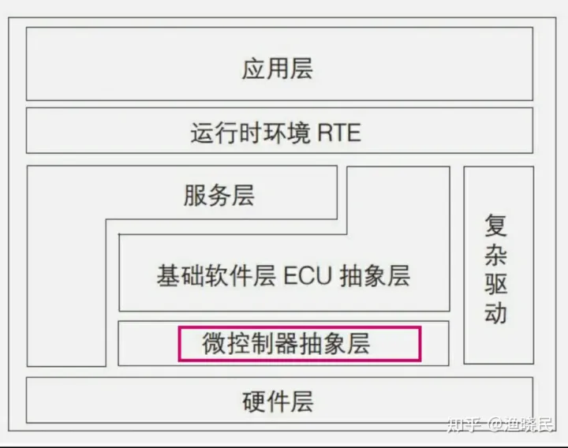

## MCAL(Microcontroller Abstraction Layer)
微控制器抽象层位于AUTOSAR BSW的最底层，包含内部驱动，可以直接访问微控制器和外设芯片。从具体应用上看，MCAL主要包括微控制器驱动，存储器驱动，通信驱动和输入输出驱动四个部分，各部分又由具体的与微控制器硬件相对应的驱动模块组成。

MCAL的存在，可以让其他层软件(如ECU抽象层，系统服务层等)，独立于MCU硬件平台，保证其软件的通用性。

MCAL配置架构包含了输入输出驱动，微控制器驱动，通信驱动，存储器驱动。

**输入输出驱动：**
PORT ： 配置MCU各个引脚的功能，对端口进行初始化。
DIO : 数字读写引脚配置。
ADC : AD模拟量采集配置。
PWM : PWM配置。
ICU : 输入捕捉
OCU : 输出比较

**微控制器驱动：**
MCU : 配置初始化，休眠，复位， MCU时钟配置。
GPT：定时器驱动。
看门狗 ： 初始化触发看门狗。

**通信驱动：**
配置 SPI LIN CAN EHT FlexRay 等控制器。

存储器驱动：
Fls :  内部Flash驱动，初始化以及对内部Flash的读、写、擦除等操作。
EEP：内部EEPROM驱动，初始化以及对内部Flash的读，写，擦除等操作。