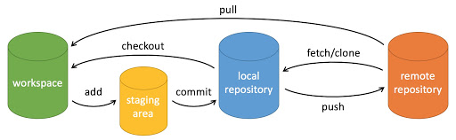

# 基础使用
https://www.runoob.com/git/git-tutorial.html

| 命令       | 说明                                   |
| ---------- | -------------------------------------- |
| git add    | 添加文件到暂存区                       |
| git status | 查看仓库当前状态                       |
| git diff   | 比较文件的不同，即暂存区与工作区的差异 |
| git commit | 提交暂存区到本地仓库                   |
| git reset  | 回退版本                               |
| git rm     | 将文件从暂存区删除                     |
| git mv     | 移动或重命名工作区文件                 |
| git log    | 查看历史提交记录                       |
| git remote | 远程仓库操作                           |
| git fetch  | 从远程仓库获取代码库                   |
| git pull   | 下载远程代码并合并                     |
| git push   | 上传远程代码并合并                     | 

Git 常用的是以下 6 个命令：**git clone**、**git push**、**git add** 、**git commit**、**git checkout**、**git pull**。

