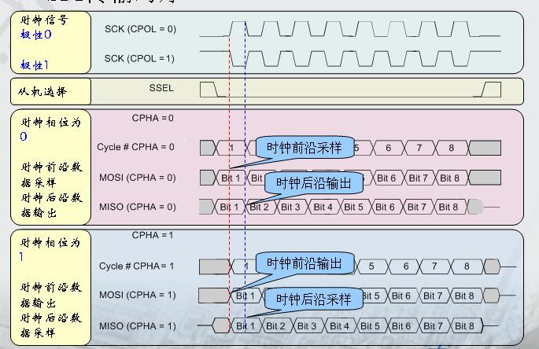
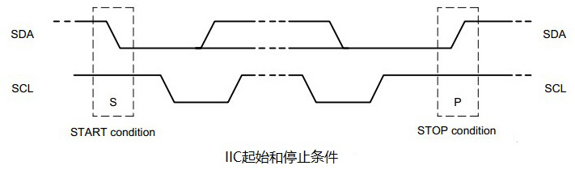
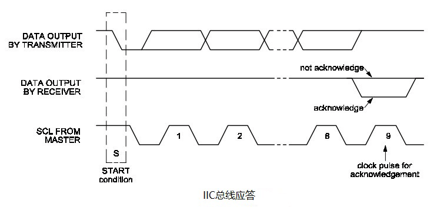

## 启动文件
启动文件主要是由汇编语言编写，是系统上电后第一个执行的程序。
主要做了以下工作。
1. 初始化堆栈指针， `SP = _initial_sp_`
2. 初始化PC指针， `PC = ResetHandler()`
3. 初始化中断向量表
4. 配置系统时钟
5. 调用 C 库中的 `_main()` 函数，初始化用户堆栈，最终调用 main()

## 链接脚本
链接脚本实质上是一个规则文件，程序对用来指挥链接器工作的一个文件，当我们写了多个C文件，调用了大量的库之后，如果编译成一个可执行文件呢，这时链接脚本文件就会发挥他的作用了：将多个目标文件(xx.o)，库文件(xx.a)，动态库(xx.so) 等等连接成一个可执行文件。

------
控制连接过程无非是控制输入段如何变成输出段；比如哪些输入段要合并成一个输出段，哪些输入段要丢弃；指定输出段的名字，装载地址，属性等等。

## SPI

Serial Periphral Interface - 串行外设接口
- 同步，串行，高速，可全双工，可实现多个SPI设备互联，硬件2-4线。
- 四种模式,由(CPOL,CPHA)确定采样边缘。
- 初始化时一般需要配置以下参数(STM32F1为例)
	主从：配置为主机或从机
	模式：全双工，半双工(只发不收，只收不发)
	位宽：8/16位
	时钟线空闲电平：高或低
	数据采样边缘：在第一个时钟边缘采样或第二个时钟边沿采样
	片选信号：硬件控制或软件控制
	时钟速率：一般为某个时钟源的分频
	数据传输方式: 高位在前或者低位在前(MSB or LSB)
	CRC值计算的多项式。
SPI 模式区分（比较常用的两种模式都是上升沿采样）
| Mode    | CPOL | CPHA |
| ------- | ---- | ---- |
| 0(常用) | 0    | 0    |
| 1       | 0    | 1    |
| 2       | 1    | 0    |
| 3(常用) | 1    | 1    |

## IIC 

Inter-Integrated Circuit - 集成电路总线
- 双向，双线，串行，多主控接口标注，速率不快，半双工，同步接口，具有总线仲裁机制。非常适用于器件之间近距离经常性数据通信，可以实现设备组网。
**起始信号** ： SCL为高电平时，SDA由高电平向低电平跳变，开始传送数据。
**结束信号** ： SCL为高电平时，SDA由低电平向高电平跳变，结束传输数据。
**应答信号** ： 从机在第九个时钟进行拉低回应，代表已经收到了主机数据。
IIC 传输数据时，数据高位在前。

## UART

Universial Asynchronous Receiver/Transmitter - 通用异步收发传输器
速度较低，可全双工结构上一般由波特率产生器，UART发送器，UART接收器组成。
- UART协议规定，当总线处于空闲时，信号线的状态为高电平，开始进行数据传输时，发送方要先发出一个低电平表示传输字符的开始(与空闲位相反)，数据位可以是5、6、7、8、9位，先发送最低位，分为无校验、奇校验、偶校验、校验位始终为1、校验位始终为0五种校验方式，停止位可以是1、1.5、2位的高电平。
- 串口流控一般用于指示数据终端就绪/数据设置就绪。
- **串口发送数据时，低位在前。**