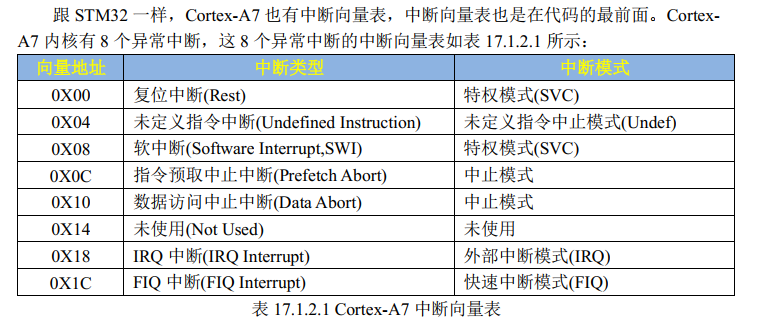
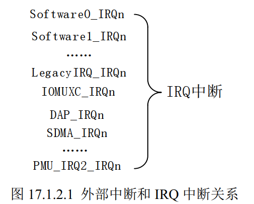

SDK包目录
```
7、 I.MX6U 参考资料->3、 I.MX6ULL SDK 包-> SDK_2.2_MCIM6ULL_RFP_Win.exe
```
正点原子教程只取了SDK中的寄存器定义文件。
```
SDK_2.2_MCIM6ULL\devices\MCIMX6Y2\drivers\fsl_common.h
SDK_2.2_MCIM6ULL\devices\MCIMX6Y2\drivers\fsl_iomuxc.h
SDK_2.2_MCIM6ULL\devices\MCIMX6Y2\MCIMX6YH2.h
```

到正点原子的裸机教程中`1、裸机例程-> 4_ledc_sdk。`获取这三个文件即可，不要安装SDK，另外，正点原子已经对三个文件做了修改，以适应教学。

然后需要重写一个 cc.h 将SDK的一些类型定义给实现了。

编写 start.S 启动文件
```
.global _start  /* 全局标号 */

_start:
    mrs r0, cpsr                    /* 进入SVC模式 */
    bic r0, r0, #0x1f               /* 将R0的低五位清零， 也就是CPSR的M0~M4 */
    orr r0, r0, #0x13               /* R0或上0x13, 表示使用SVC模式 */
    msr cpsr, r0                    /* 将R0数据写到CPSR中 */

    ldr sp, =0x80200000             /* 设置栈指针 */
    b main                          /* 跳转到main函数 */
```

然后编写一个实现LED toggle的main 函数。

编写 Makefile 和链接脚本
Makefile
```
CROSS_COMPILE	?= arm-linux-gnueabihf-
NAME			?= ledc

CC              := $(CROSS_COMPILE)gcc
LD              := $(CROSS_COMPILE)ld
OBJCOPY         := $(CROSS_COMPILE)objcopy
OBJDUMP         := $(CROSS_COMPILE)objdump

OBJS            := start.o main.o

$(NAME).bin:$(OBJS)
	$(LD) -Timx6ul.lds -o $(NAME).elf $^
	$(OBJCOPY) -O binary -S $(NAME).elf $@
	$(OBJDUMP) -D -m arm $(NAME).elf > $(NAME).dis

%.o:%.s
	$(CC) -Wall -nostdlib -c -O2 -o $@ $<

%.o:%.S
	$(CC) -Wall -nostdlib -c -O2 -o $@ $<

%.o:%.c
	$(CC) -Wall -nostdlib -c -O2 -o $@ $<

clean:
	rm -rf *.o $(NAME).bin $(NAME).elf $(NAME).dis

```

链接脚本
```
SECTIONS{
    . = 0X87800000;
    .text :
    {
        start.o
        main.o
        *(.text)
    }
    .rodata ALIGN(4)    : {*(.rodata*)}
    .data ALIGN(4)      : {*(.data)}
    __bss_start = .;
    .bss ALIGN(4)       : {*(.bss) *(COMMON)}
    __bss_end = .;
}
```


### BSP工程管理
根据第17章完成BSP工程的建立。

### IMX6UL 中断
对于 Cortex-M 内核来说，中断向量表列举出了一款芯片所有的中断向量，包括芯片外设的所有中断。对于 CotexA 内核来说并没有这么做，在表 17.1.2.1 中有个 IRQ 中断， Cortex-A 内核 CPU 的所有外部中断都属于这个 IRQ 中断，当任意一个外部中断发生的时候都会触发 IRQ 中断。在 IRQ 中断服务函数里面就可以读取指定的寄存器来判断发生的具体是什么中断，进而根据具体的中断做出相应的处理。这些外部中断和 IRQ 中断的关系如图 17.1.2.1 所示：



在图 17.1.2.1 中，左侧的 Software0_IRQn~PMU_IRQ2_IRQ 这些都是 I.MX6U 的中断，他们都属于 IRQ 中断。当图 17.1.2.1 左侧这些中断中任意一个发生的时候 IRQ 中断都会被触发，所以我们需要在 IRQ 中断服务函数中判断究竟是左侧的哪个中断发生了，然后再做出具体的处理。

根据表格中的数据编写中断向量表， 中断向量表位于程序最开始的地方，即start.S
Eg.
```
.global _start

_start:
	ldr pc, = Reset_Handler
	ldr pc, = Undefined_Handler
	...

Reset_Handler:
	...
	
```

